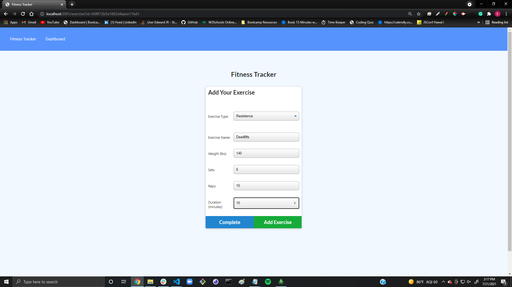

# Fitness Tracker 

# Description

An app designed to help you keep track of your workouts!

# Table Of Contents

- [Installation](#installation)
- [Usage](#usage)
- [License](#license)
- [Contributing](#contributing)
- [Tests](#tests)
- [Questions](#questions)

# Installation

User should only need a working browser to launch this deployed application.

# Usage

Open the App, and begin by clicking on "New Workout". Select your exercise type with the dropdown menu ("Resistance or Cardio"), then complete the input fields by adding your exercise type, name, weight, number of sets, number of reps, total duration, etc. Once You filled all the fields in, you can either click "Complete" or "Add Exercise" to add another. From here you can navigate to the dashboard tab where you will see your progress charted with a duration line chart and a weight bar graph. Enjoy!

# License

This application is protected under conditions of the MIT license.

# Contributing

I am the only contributor to this project.

# Tests

No tests are needed at the moment.

# Questions

My GitHub Profile: http://www.github.com/relentlessreed  
Please feel free to contact me with any inquiries via email at relentlessreed@gmail.com.
